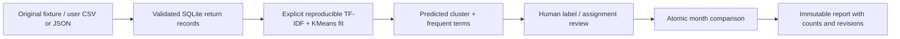
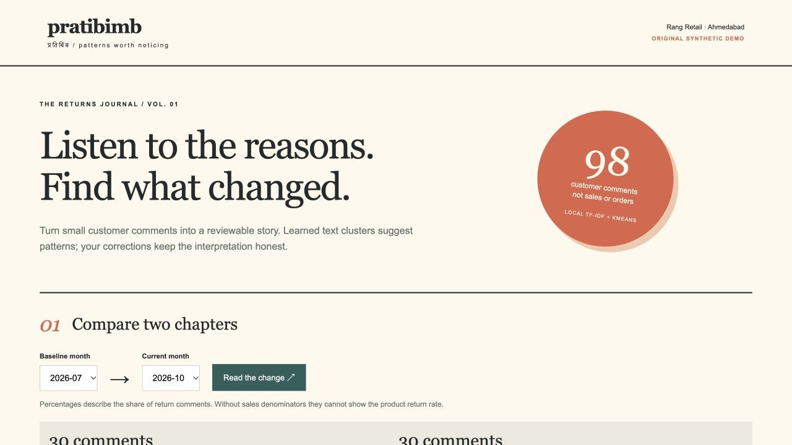
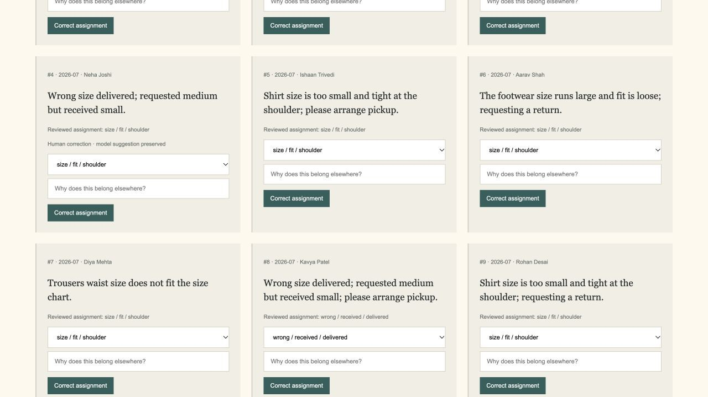
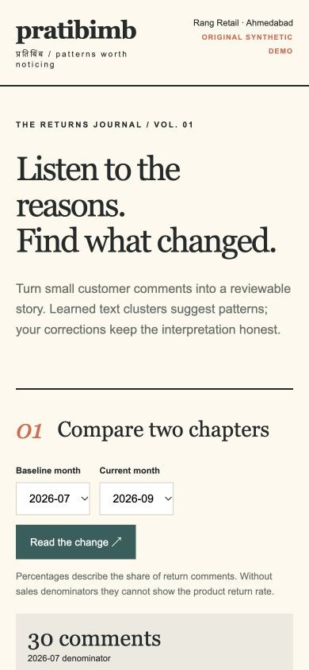

# Pratibimb — Product Return Insights

A small returns journal for fictional **Rang Retail, Ahmedabad**. Learn recurring patterns from return comments, read representative examples, correct assignments and compare months with explicit denominators.

**Python · Flask · SQLite · TF-IDF + KMeans · vanilla JavaScript**

The model learns text clusters locally. Frequent terms label those clusters; a human can rename them. This is an unsupervised educational application, not an LLM and not a claim of production classification accuracy.

Clone commands below use this project's public repository URL. If you already have this folder locally, skip `git clone` and `cd`.

## Setup independently

This folder is a standalone repository. It does not import code or packages from sibling projects. Use **Python 3.10–3.12**; Python 3.13+ is outside the pinned OCR/numerical dependency scope. Dependencies install from PyPI; inference and app workflows then run locally without API keys. macOS/Linux and Windows commands below are installation instructions; the recorded local run used macOS and Python 3.12.14.

macOS / Linux:

```sh
git clone https://github.com/Siddh-sys-rgb/pratibimb-return-insights.git
cd pratibimb-return-insights
python3 -m venv .venv
source .venv/bin/activate
python -m pip install -r requirements-dev.txt
python app.py --port 8111
```

Windows PowerShell:

```powershell
git clone https://github.com/Siddh-sys-rgb/pratibimb-return-insights.git
cd pratibimb-return-insights
py -3.12 -m venv .venv
.\.venv\Scripts\Activate.ps1
python -m pip install -r requirements-dev.txt
python app.py --port 8111
```

If activation is blocked by your local PowerShell policy, use `.\.venv\Scripts\python.exe` directly for the last two commands. Keep the terminal running and stop with Ctrl+C. The server binds to `127.0.0.1` with debug disabled. This is a local demonstration, not a hosted production service.

Data is persisted under ignored `data-local/`. Use `python app.py --data-dir /path/to/another-folder --port 8111` for an isolated workspace. `--no-demo` skips seeding an empty database; it does not delete existing data. Each app has its own cookie name, database and local signing key. Do not share your data folder or its `.session-key`.

Open **http://127.0.0.1:8111**.

## Demo walkthrough

1. Select July as baseline and September as current, then click **Read the change**. Each contains **30 return comments**. The comparison explicitly shows both denominators. Opening or refreshing the journal displays the latest saved report without creating a new snapshot.
2. Inspect the four learned patterns. Frequent terms and representative comments help you interpret the clusters; rename a label after reading the evidence.
3. Filter comments by month or pattern. Change one assignment, enter a review reason, and save. The original model prediction stays available; the human assignment and audit history are separate.
4. Compare months again to see how that correction affects the report. An older comparison remains unchanged in the archive.
5. Open the model notebook and run the six separate evaluation pairs. They test a few expected same/different-cluster relationships and were not fitted as training comments.
6. Upload `demo/import-comments.csv` under **Bring your own comments**. These eight authored examples are tagged `user-import` because they entered through the import workflow; imported data is never silently labelled as seed data.
7. Click **Fit / refresh clusters**. Imported comments move out of the pending queue, the seeded fit is reproducible and prior manually corrected assignments remain attached to stable cluster IDs.
8. To try your own empty workspace, run `python app.py --no-demo --data-dir data-empty --port 8111`. Import at least four distinct comments and fit clusters; no demo dataset is needed.

## Your own data

UTF-8 CSV columns are `month,comment,customer`. Month must be a valid `YYYY-MM`; customer is optional and defaults to `Anonymous reviewer`. Use fictional or redacted names for demonstrations. JSON imports use the same fields in a `records` list.

```csv
month,comment,customer
2026-10,Parcel packaging arrived crushed and glass broken,Diya Patel
2026-10,The shirt fit is tight and size too small,Aarav Shah
2026-10,Wrong colour and different model received,Kavya Mehta
2026-10,The device battery stopped charging,Rohan Desai
```

Imports allow 1–200 rows, 200 KB for CSV, 5–1000 characters per comment and 1–80 characters per customer. A workspace holds at most 1000 comments. Whole batches validate before any row is inserted. An identical normalized batch cannot be imported twice; distinct records may legitimately repeat a comment. Pending imports are excluded from comparisons until a fit assigns them. Retraining is an explicit user action, not a hidden result of import.

## Model and measurement honesty

- Training uses comment text only: TF-IDF unigrams/bigrams, English stop-word removal, a 2500-feature cap and KMeans with `k=4`, `random_state=42`, `n_init=10`.
- The original fixture has 90 rows produced from 16 authored comment templates and simple suffixes. These repetitions are useful for a bounded demo, **not 90 independent accuracy observations**. Names, months and fixture theme labels are not model inputs.
- Four clusters are a deliberate scope choice. They do not establish the correct number of topics in a real dataset. Sparse unrelated imports, mixed languages and large data shifts may yield poor clusters.
- Cluster terms and one example are evidence for interpretation. Terms do not establish causal reasons or business recommendations. Human labels can become stale after a data change; review them after fitting.
- On refit, new cluster IDs are aligned to previous predictions by maximum overlap. Explicit manual corrections are preserved. The unsupervised cluster meaning can still drift; this is documented rather than represented as guaranteed semantic stability.
- Monthly percentages use **assigned return-comment counts as denominators**. Without sales/orders, this app cannot calculate the product return rate. Changes are percentage points, not relative-percent growth.
- Separate evaluation has six authored pairs. The recorded model passes **6/6 relationship checks**. This is a smoke check, not an accuracy metric or held-out customer study; no evaluation text is inserted into fitting data.

## Architecture



`domain.py` owns the authored fixture, vectorizer, learned clustering and separate evaluation pairs. `app.py` owns data import, provenance, protection, SQLite transactions and comparisons. Return records keep model prediction and human assignment separately. Cluster labels have revision guards; corrections append an audit record atomically. Snapshots record both month denominators and every contributing return revision. Original comparisons remain stable after edits or refitting.

Fitted models are reconstructed locally from saved fitted comments when the process restarts; unsafe pickle files are not accepted. This single-process demo does not implement distributed model-serving synchronization. Fit requests use a workspace revision guard and an atomic SQLite transaction. Whole-batch import hashes prevent retry duplication. Local sessions, CSRF tokens, trusted hosts, literal text rendering and a restrictive content policy protect app writes and display.

## API

Start with `GET /api/session`, retain its cookie, and send its `csrf_token` as `X-CSRF-Token` on writes.

| Method | Endpoint | Purpose |
|---|---|---|
| GET | `/api/health` | Runtime / model identity |
| GET | `/api/session` | Local session and CSRF token |
| GET | `/api/workspace` | Comments, clusters, provenance, months, audit and workspace revision |
| POST | `/api/import` | Multipart CSV `file` or JSON `{records: [...]}` |
| POST | `/api/recluster` | Fit all comments using `{workspace_revision: ...}` |
| PATCH | `/api/returns/<id>` | `{revision, cluster_id, note}` correction |
| PATCH | `/api/clusters/<id>` | `{revision, label}` rename |
| POST | `/api/comparisons` | `{baseline: "YYYY-MM", current: "YYYY-MM"}` snapshot |
| GET | `/api/comparisons` | Latest 20 saved reports |
| GET | `/api/evaluation` | Separate same/different-cluster pair checks |

Invalid fields return 400; missing objects 404; stale revisions, repeated imports or unavailable models 409; missing/invalid CSRF or cross-origin writes 403; oversized requests 413; busy databases 503. Empty demo-disabled workspaces respond to health/workspace routes and accept imports without fitting on startup.

## Verification

```sh
python -m pytest -q --cov=app --cov=domain --cov-report=term-missing
python -m pip check
node --check static/app.js
```

Recorded local result: **45 passed**, **97.41% statement coverage**. Tests verify reproducible fits, feature isolation from fixture labels/names, separate evaluation texts, exact monthly denominators, immutable snapshots, stale corrections/labels/fits, competing corrections, import validation and rollback, import provenance and deduplication, correction preservation after refitting, no-demo importing, CSRF and trusted hosts.

`constraints-tested.txt` captures the local resolved versions. Install from requirements for your platform; the constraints file is not forced across Python versions. The configured Linux workflow tests Python 3.10 and 3.12 after publication; successful remote checks are not presumed here.

## Screenshots







Real captures from the running local app using fictional records. [Browser verification](docs/BROWSER_CHECKS.md).

## Limitations and next steps

The database is a single local workspace. There is no order/sales table, real customer ingestion, authentication, hosted deployment or causal recommendation engine. A next iteration could add count-aware sales denominators, richer input contracts, reviewed cluster merge/split operations and drift evaluation against an independently collected dataset. For hosted use, add HTTPS, identity, tenant boundaries and an asynchronous fit job with a versioned model artifact.

Original synthetic fixtures/source use the [MIT license](LICENSE). Dependencies keep their own licenses. Implementation references: [scikit-learn text features](https://scikit-learn.org/stable/modules/feature_extraction.html#text-feature-extraction), [KMeans API](https://scikit-learn.org/stable/modules/generated/sklearn.cluster.KMeans.html) and [Flask security considerations](https://flask.palletsprojects.com/en/stable/web-security/). No external return dataset, paid API or trained-on-customer claim is involved.
